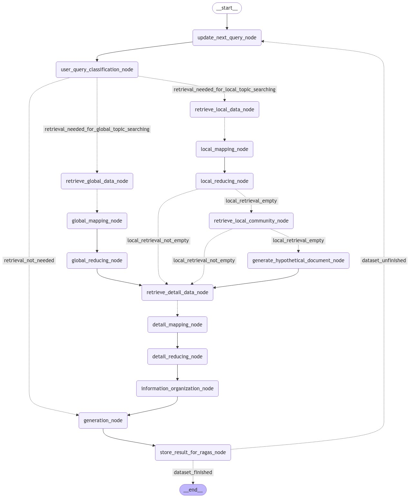

# Multi-Agentic Hybrid RAG Experiment

## 前提

Graph RAG（microsoft） 的費用高昂，若是由 LLM 提取 entity 並且多次進行 glean，費用會更高。

### Graph RAG 說明
1. 會先用 splitter 將 context 拆分成多個 chunk。
2. 使用 LLM 提取 entity ，並且建立 entity 和 entity 的 relation。
3. 將 entity 和 entity 的 relation 建立成 graph。
4. 多個 entity 和 relation 會被總結成 community。
5. 多個 community 也可以被總結成 community。
6. 遞迴上去，產生多層結構（越上層越抽象化）。

### Vector RAG 說明

1. 會先用 splitter 將 context 拆分成多個 chunk。
2. 使用 hybrid search (dense + sparse embedding) 進行 RAG。
3. 透過 HyDE 產生第二種 query 後，使用 Vector RAG 進行搜尋。
4. 透過 reranking 來提升 LLM inference 的結果。

*HyDE 的原理：
透過猜測使用者 query 的答案，以答案來進行搜尋。

### Graph RAG 和 Vector RAG 的優缺點比較

- Graph RAG 的優點：
  - 可以提取文本全域的資訊。
  - 可以透過心智圖的方式呈現文本的解構，以及搜尋到的資訊與其他資訊的關係。
  - Inference 的費用較 Vector RAG 稍微便宜。

- Graph RAG 的缺點：
  - 建立 Index 的費用高昂。
  - 對於細部的資訊，可能會因為被 LLM 處理過，而導致資訊的遺失。

- Vector RAG 的優點：
  - 可以處理細部的資訊。
  - 建立 Index 的成本只需要 embedding 的費用。

- Vector RAG 的缺點：
  - 無法處理全域的資訊(片段化資訊提取)。

## 提案

先利用建立 Vector Database 以分群的方法嘗試將文本分群，並且將每個群體的文本從比例上抽樣，以建立 Graph RAG 的資料集，來減少 Graph RAG 的費用。

Graph RAG 因為建立資料時，取出的比例較原本少，導致資訊遺失，怎麼解決？
-> 使用 Multi-Agent 的方式，結合兩方優點 (建立 index 的成本較便宜，retrieval 的結果較好，包含細部和全域檢索)。

### 方法

先將使用者 query 進行分類，分類成全域、細部，和不需要 retrieval 的 query（使用 general knowledge 回答）。

- 全域 query：使用 Graph RAG 進行搜尋，以收尋到的 data 進行 HyDE 產生第二種 query 後，使用 Vector RAG 進行搜尋。
- 細部 query：使用 Vector RAG 進行搜尋，同樣使用 HyDE 產生第二種 query 後，使用 Graph RAG 進行搜尋。
- 不需要 retrieval 的 query：使用 general knowledge 回答。

## 注意的點

1. 使用 sparse embedding 需要先建立文本的 corpus。
2. graph rag (microsoft) 這邊先轉移至 Neo4j，自己寫 cypher 來產生更好搜尋方式。
3. LangGraph 的 workflow 在 jupyter notebook 上若需要執行，要用 nest_asyncio 來解決。
4. 建議連線至 milvus 或 neo4j 的 client 都使用 singleton 的方式設計，以避免多次連線，或是 memory 爆炸。
5. 不建議使用 crewai 來製作 multi-agent，crewai 本身有很多問題，像是在 thread 配合 langgraph 的時候，會導致 thread 的 context 遺失。
6. 用 poetry 來管理套件，並且使用 poetry.lock 來固定套件版本。
7. 能使用 langchain 或是 llama-index 的地方就盡量使用，以減少重複造輪子，或從最底層的地方開始。

## 建議發展

1. 更換 multi-agent 的 framework（crewai），使用 llama-index 或是 langchain 的 agent 來製作。
2. 可以試試 LLM text-2-cypher 的方式來取代這邊寫死的部分。
3. 可以參考 LightRAG 的架構，來進行發展 (後來發現這個計劃中，有很多想法跟 LightRAG 很像)。